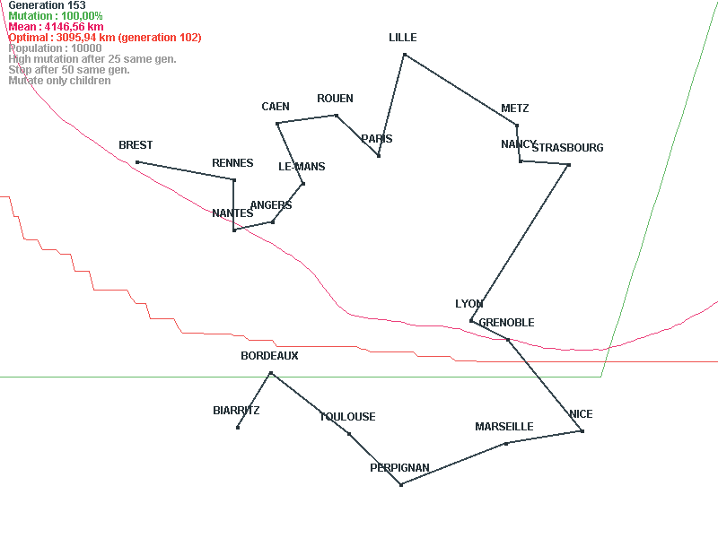
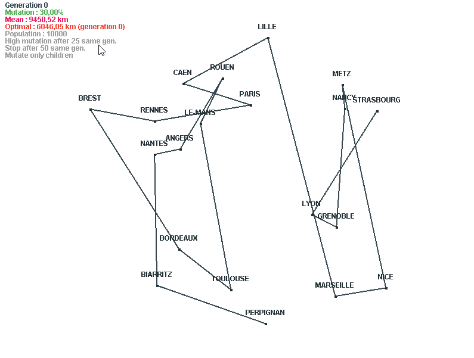
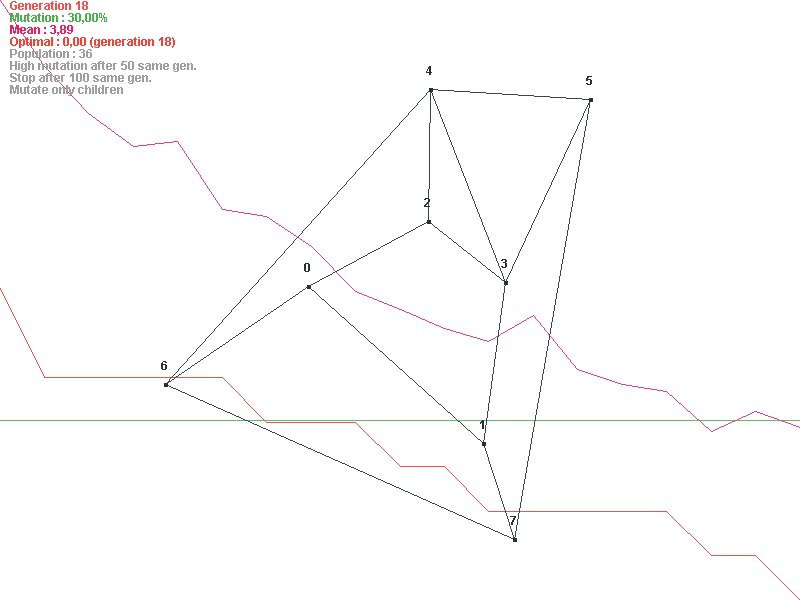

# Genetics

Messing around with genetic algorithms

Properties `src/main/resources/config.properties` (or edit inside JAR / override by placing file in the same folder)

## Traveling Salesman

```
mvn clean package -P bot
```

* Launch `fr.klemek.genetics.bot.Window`
* Parameters `src/main/resources/bot.properties`
* Data `src/main/resources/cities.csv`





## Not-intersecting graph

```
mvn clean package -P graph
```

* Launch `fr.klemek.genetics.graph.Window`
* Parameters `src/main/resources/graph.properties`
* Data `src/main/resources/graph.csv`

